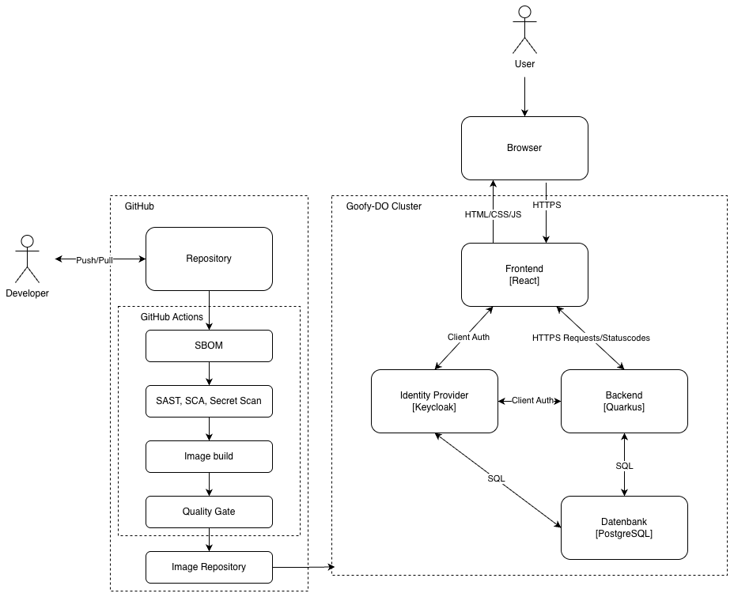
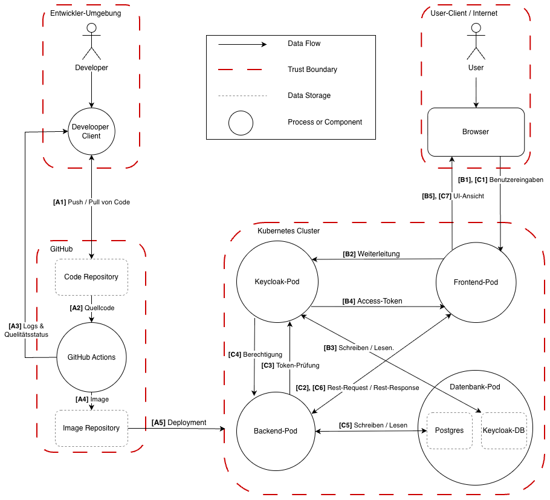
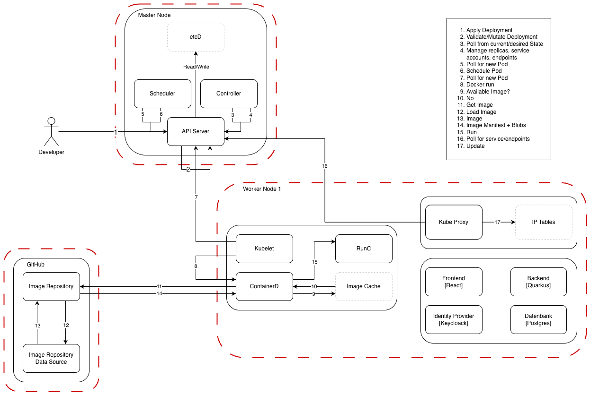

# Architektur

## 1 Systemübersicht

Die Web-Applikation ist als moderne Microservice-Anwendung konzipiert.
Nutzer greifen über einen Webbrowser auf das im Kubernetes-Cluster betriebene Frontend zu. Dieses ist als
Single-Page-Application mit React umgesetzt und wird vom Cluster als statischer Webservice ausgeliefert. Das Frontend
kommuniziert über eine REST-API mit dem im selben Cluster betriebenen Backend, das auf dem Java-Framework Quarkus
basiert. Persistente Daten werden in einer separaten PostgreSQL-Datenbank gespeichert, auf die ausschließlich das
Backend per SQL zugreift. Für Authentifizierung und Autorisierung wird ein Identity Provider auf Basis von Keycloak
eingebunden, der sowohl vom Frontend als auch vom Backend über Client-Authentifizierung angesprochen wird und zentral
Tokens sowie Rolleninformationen bereitstellt. Dieser läuft ebenso lokal im Kubernetes-Cluster.
Die Bereitstellung der Anwendung erfolgt containerbasiert und wird vollständig über GitHub und GitHub Actions
automatisiert. Änderungen am Quellcode werden von den Entwicklern in ein zentrales GitHub-Repository eingecheckt,
woraufhin eine CI-Pipeline angestoßen wird. Diese erzeugt zunächst ein Software Bill of Materials (SBOM) und führt
anschließend statische Codeanalyse (SAST), Dependency-Scans (SCA) sowie Secret-Scanning durch. Nur bei erfolgreichem
Durchlauf wird das Container-Image gebaut, über ein Quality Gate geprüft und in ein Image-Repository übertragen. Von
dort aus wird das geprüfte Image in das Kubernetes-Cluster ausgerollt, sodass ausschließlich durch den definierten
Sicherheitsprozess geprüfte Versionen der Web-Applikation produktiv betrieben werden.

## 2 Softwareumgebung

- **Frontend:** React mit TypeScript
- **Styling:** Tailwind mit CSS
- **Authentifizierung:** Keycloak
- **Backend:** Quarkus mit Java
- **Datenbank:** PostgreSQL
- **Kommunikation:** REST-API
- **Deployment:** Kubernetes mit Minikube

## 3 Architekturdiagramm
Die in Abbildung 1 dargestellte Übersicht visualisiert die beschriebene System- und Deployment-Architektur der
Anwendung. Das Diagramm zeigt sowohl die Interaktionen der Laufzeitkomponenten als auch die Anbindung der CI/CD-Pipeline
über GitHub Actions und das Container-Image-Repository.  
  
  
*Abbildung 1: Architekturdiagramm der Web-Applikation*

## 4 Data-Flow-Diagramm
Das in Abbildung 2 dargestellte Data-Flow-Diagramm beschreibt die drei wesentlichen Datenflüsse sowie die zugehörigen 
Vertrauensgrenzen der Anwendung vom Entwicklungsprozess bis zur Nutzung durch die Endanwender. 
- **Prozess A** beschreibt den Weg des Quellcodes von der lokalen Entwicklerumgebung über das GitHub-Code-Repository in die automatisierte
CI-Pipeline mit GitHub Actions und das anschließende Ablegen der erzeugten Container-Images im Image-Repository.  
- **Prozess B** bildet den Anmelde- bzw. Registrierungsprozess der Nutzer über den Identity Provider Keycloak ab. Der 
Browser der Nutzer kommuniziert mit dem Frontend-Pod, welcher Access-Tokens über den Keycloak-Pod bezieht, welcher die 
Nutzeridentitäten in der Keycloak-DB verwaltet.
- **Prozess C** stellt die Interaktionen der Nutzer mit der Web-Applikation dar, inklusive der Kommunikation zwischen
Frontend, Backend und Datenbank. Das Backend validiert dabei die Access-Tokens über den Keycloak-Pod, die das Frontend 
bei jeder Anfrage mitsendet und greift auf die PostgreSQL-Datenbank zu, um persistente Daten zu verwalten.
  
  
*Abbildung 2: Data-Flow-Diagramm der Web-Applikation*

Das in Abbildung 3 dargestellte Data-Flow-Diagramm vertieft den Deployment-Prozess innerhalb des Kubernetes-Clusters.
Der Entwickler übergibt dem Kubernetes API Server ein Deployment-Manifest, das vom API Server validiert und im 
gewünschten Zielzustand in etcd gespeichert wird. Die Controller erkennen die Änderung und erzeugen bzw. aktualisieren 
daraus die notwendigen Pod-Objekte, woraufhin der Scheduler die Pods einem Worker Node zuweist. Auf dem ausgewählten 
Node zieht der kubelet die Pod-Spezifikation, beauftragt containerd mit dem Start und containerd prüft zunächst den 
lokalen Image-Cache. Fehlt das Image, wird es aus dem Image Repository samt Manifest und Layern heruntergeladen. 
Anschließend startet runC den Container, und Kubernetes aktualisiert Services/Endpoints, sodass der neue Pod über die 
vorgesehenen Netzwerkpfade erreichbar ist.

*Abbildung 3: Data-Flow-Diagramm des Kubernetes-Deployments*