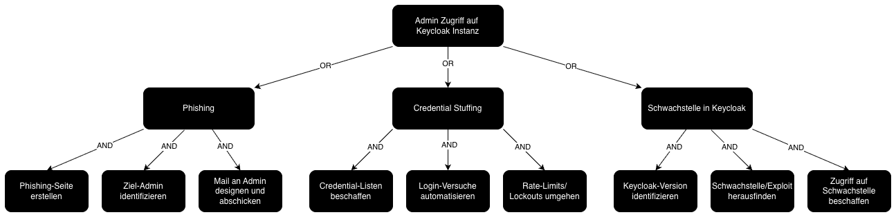

# Attack Tree
[K01](./00_STRIDE.md#13-keycloak) stellt aus unserer Sicht das Worst-Case-Szenario dar, weil es die Identitäts- und Zugriffsebene Keycloak direkt 
angreift. Keycloak ist die zentrale Vertrauenskomponente für Authentifizierung und Autorisierung. Gelingt es einem 
Angreifer, sich als legitimer Admin auszugeben, kompromittiert er nicht nur einen einzelnen Account, sondern potenziell 
die gesamte Zugriffskontrolllogik der Plattform.  

Mit einem Keycloak-Admin-Account kann ein Angreifer typischerweise Rollen und Berechtigungen verändern, neue 
privilegierte Konten anlegen, Clients/Redirect-URIs und Token-/Scope-Konfigurationen manipulieren und damit 
persistenten Zugriff etablieren. Dadurch sind sowohl Vertraulichkeit (Zugriff auf geschützte Daten), Integrität 
(Manipulation von Rollen, Policies und ggf. Geschäftsdaten über privilegierte APIs) als auch Verfügbarkeit 
(z. B. durch Deaktivierung von Clients oder Auth-Flows) in großem Umfang gefährdet.  

*Abbildung 3: Attack Tree zu K01*
  
## Gegenmaßnahmen
Folgende Maßnahmen können helfen, das Risiko eines erfolgreichen Angriffs auf Keycloak zu minimieren:  

**Phishing-Schutz**
- **Phishing-Seite:** SSL-Zertifikat, kein Favicon, Domain überprüfen
- **Ziel-Admin identifizieren:** Admin-Identitäten nicht öffentlich, Accountnamen anonymisieren
- **Mail an Admin:** Schulung zu Phishing, verdächtige Mails melden, Mail-Filter
- **Generell:** Mindestens 2FA für Admins, idealerweise Passkeys, Meldung bei ungewöhnlichen Logins
  
**Credential Stuffing**
- **Credential Liste beschaffen:** Darknet-Monitoring, Leak-Datenbanken
- **Logins automatisieren:** Tools wie Hydra, Burp Suite, Rate-Limiting
- **Rate-Limits/Lockouts umgehen:** Captchas, IP-Blockierung
- **Generell:** Starke, einzigartige Passwörter, Passwortmanager, 2FA/Passkeys

**Schwachstelle in Keycloak ausnutzen**
- **Keycloak Version identifizieren:** Version-Banner minimieren, keine Debug-Seiten, keine öffentlich sichtbaren Build-Infos
- **Bekannte Schwachstelle/Exploits finden:** Schnelles Patch-Management, Vulnerability-Scanning, regelmäßige Updates
- **Zugriff auf Schwachstelle erlangen:** Minimierung der Angriffsfläche, Netzwerksegmentierung, Meldungen bei Zugriffen auf Admin-Endpunkte von unerwarteten Netzen